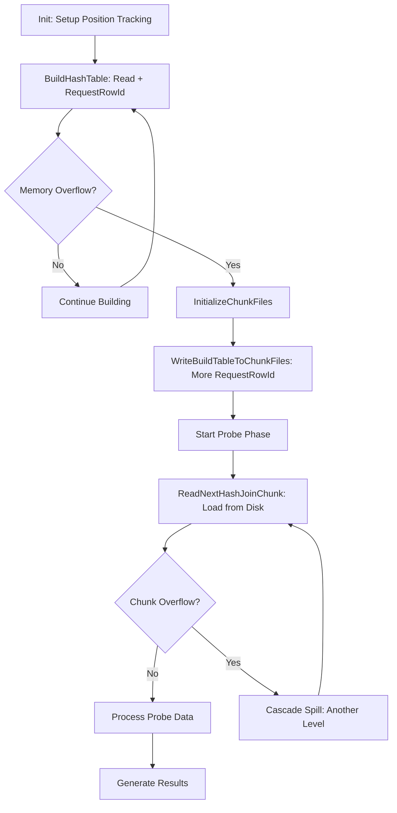

# **📊 COMPREHENSIVE END-TO-END HASH JOIN BUILD ANALYSIS**

## **🏗️ HASH JOIN ARCHITECTURE OVERVIEW**

### **Core Components**
- **HashJoinIterator**: Main orchestrator managing build/probe phases
- **HashJoinRowBuffer**: In-memory hash table with overflow detection  
- **ChunkPair**: Disk storage for spilled build/probe data
- **TableCollection**: Position management and row ID tracking
- **State Machine**: Controls flow between memory/disk operations

### **State Machine Flow**
```cpp
enum State {
  READING_ROW_FROM_PROBE_ITERATOR,     // Normal probe processing
  READING_ROW_FROM_PROBE_CHUNK_FILE,   // Processing spilled probe data
  READING_ROW_FROM_PROBE_ROW_SAVING_FILE, // Unmatched probe rows
  LOADING_NEXT_CHUNK_PAIR,             // Loading next chunk from disk
  READING_FIRST_ROW_FROM_HASH_TABLE,   // Start hash table lookup
  READING_FROM_HASH_TABLE,             // Continue hash table traversal
  END_OF_ROWS                          // Join complete
};
```

---

## **⚙️ PHASE 1: INITIALIZATION (`HashJoinIterator::Init()`)**

### **Setup Process**
```cpp
bool HashJoinIterator::Init() {
  // 1. Clear previous execution state
  m_build_input->SetNullRowFlag(false);
  
  // 2. Invalidate cached single-row lookups
  for (AccessPath *lookup : m_single_row_index_lookups) {
    lookup->eq_ref().ref->key_err = true;
  }
  
  // 3. Check for hash table reuse optimization
  if (m_row_buffer.Initialized() && can_reuse_hash_table()) {
    return InitProbeIterator(); // Skip rebuild
  }
  
  // 4. Initialize build input for position tracking
  if (m_first_input == HashJoinInput::kBuild) {
    m_build_input_tables.PrepareForRequestRowId(); // ← Position preparation
    if (m_build_input->Init()) return true;
  }
  
  // 5. Setup memory management
  m_hash_join_type = HashJoinType::IN_MEMORY;
  size_t upper_row_size = ComputeMaxRowSize();
  if (m_temporary_row_and_join_key_buffer.reserve(upper_row_size)) {
    return true; // OOM
  }
  
  // 6. Handle geometry columns for spill compatibility
  SetGeometryColumnOptimizations();
  
  // 7. Start hash table building
  return BuildHashTable();
}
```

### **Key Initialization Steps**
1. **Position Tracking Setup**: `PrepareForRequestRowId()` prepares tables for position() calls
2. **Memory Buffer Allocation**: Reserves space for row data and join keys  
3. **Spill Preparation**: Sets up geometry column handling for disk operations
4. **State Machine Reset**: Initializes to IN_MEMORY processing mode

---

## **🔨 PHASE 2: NORMAL HASH TABLE BUILDING (`BuildHashTable()`)**

### **Core Build Loop**
```cpp
bool HashJoinIterator::BuildHashTable() {
  // 1. Restore last stored row for nested loop compatibility
  if (m_row_buffer.Initialized() && m_row_buffer.LastRowStored()) {
    LoadImmutableStringIntoTableBuffers(m_build_input_tables, 
                                        m_row_buffer.LastRowStored());
  }
  
  // 2. Initialize row buffer
  if (InitRowBuffer()) return true;
  
  const bool reject_duplicate_keys = RejectDuplicateKeys();
  PFSBatchMode batch_mode(m_build_input.get());
  
  // 3. Main build loop
  for (;;) {
    int res = m_build_input->Read(); // Read from build iterator
    if (res == 1) return true;       // Error
    if (res == -1) {                 // EOF
      m_build_iterator_has_more_rows = false;
      HandleEmptyBuildInput();
      return false;
    }
    
    assert(res == 0); // Successfully read a row
    
    // 4. 🔑 CRITICAL: Store position for potential spill operations
    m_build_input_tables.RequestRowId();
    
    // 5. Try to store row in hash table
    const hash_join_buffer::StoreRowResult store_result = 
        m_row_buffer.StoreRow(thd(), reject_duplicate_keys);
        
    // 6. Handle storage result
    switch (store_result) {
      case StoreRowResult::ROW_STORED:
        break; // Continue loop
        
      case StoreRowResult::BUFFER_FULL:
        return HandleMemoryOverflow(); // Trigger spill-to-disk
        
      case StoreRowResult::FATAL_ERROR:
        return true; // Unrecoverable error
    }
  }
}
```

### **Position Storage Timing**
- **Before StoreRow()**: Position is stored BEFORE attempting hash table insertion
- **Ensures Availability**: Position is available if memory overflow occurs
- **All Build Rows**: Every build row gets position() called, not just spilled ones

---

## **🚨 PHASE 3: MEMORY OVERFLOW DETECTION & SPILL TRIGGER**

### **Overflow Detection Logic**
```cpp
// Inside m_row_buffer.StoreRow():
1. Attempt to store row in hash table
2. Check memory usage AFTER insertion  
3. If exceeds join_buffer_size → Return BUFFER_FULL
4. Row is kept in hash table (not removed)
```

### **Spill Decision Tree**
```cpp
case StoreRowResult::BUFFER_FULL:
  if (!m_allow_spill_to_disk) {
    // 1. No spill allowed → Enable probe row saving
    InitWritingToProbeRowSavingFile();
    SetReadingProbeRowState();
    return false;
  } else {
    // 2. Spill allowed → Initialize chunk files
    if (InitializeChunkFiles(...)) return true;
    if (WriteBuildTableToChunkFiles()) return true;
    
    // 3. Setup for chunk processing
    for (ChunkPair &chunk : m_chunk_files_on_disk) {
      chunk.build_chunk.Rewind();
    }
    SetReadingProbeRowState();
    return false;
  }
```

### **Memory Management Strategy**
- **Lazy Detection**: Memory limits checked AFTER row insertion
- **Guaranteed Progress**: At least one row always fits in buffer
- **Spill vs Save**: Different strategies based on spill_to_disk setting

---

## **💾 PHASE 4: SPILL-TO-DISK MECHANISM**

### **Chunk File Initialization (`InitializeChunkFiles()`)**
```cpp
static bool InitializeChunkFiles(...) {
  // 1. Calculate chunk count based on remaining rows
  const size_t remaining_rows = estimated_rows - rows_in_hash_table;
  const size_t chunks_needed = ceil(remaining_rows / current_density);
  const size_t num_chunks = min(kMaxChunks, chunks_needed);
  
  // 2. Ensure power-of-2 for hash optimization
  const size_t num_chunks_pow_2 = std::bit_ceil(num_chunks);
  
  // 3. Initialize build and probe chunk pairs
  chunk_pairs->resize(num_chunks_pow_2);
  for (ChunkPair &pair : *chunk_pairs) {
    if (pair.build_chunk.Init(build_tables, false) ||
        pair.probe_chunk.Init(probe_tables, include_match_flag)) {
      return true; // File creation error
    }
  }
  return false;
}
```

### **Build Data Spill (`WriteBuildTableToChunkFiles()`)**
```cpp
bool HashJoinIterator::WriteBuildTableToChunkFiles() {
  for (;;) {
    int res = m_build_input->Read(); // Continue reading build input
    if (res == -1) return false;     // EOF - success
    if (res == 1) return true;       // Error
    
    assert(res == 0);
    
    // 🔑 CRITICAL: Store position for remaining build rows
    m_build_input_tables.RequestRowId();
    
    // Write row + position to appropriate chunk file
    if (WriteRowToChunk(thd(), &m_chunk_files_on_disk,
                        /*write_to_build_chunk=*/true,
                        m_build_input_tables, m_join_conditions,
                        /*row_has_match=*/false,
                        /*store_row_with_null_in_join_key=*/false,
                        &m_temporary_row_and_join_key_buffer)) {
      return true; // Write error
    }
  }
}
```

### **Chunk File Structure**
Each chunk file stores:
- **Row Data**: Complete column values for the row
- **Join Key**: Computed hash join key for this row
- **Position Data**: Stored table->file->ref from RequestRowId()
- **Match Flags**: For outer join processing
- **Null Indicators**: For join condition handling

---

## **🔄 PHASE 5: CHUNK PROCESSING & POSITION USAGE**

### **Chunk-by-Chunk Processing (`ReadNextHashJoinChunk()`)**
```cpp
bool HashJoinIterator::ReadNextHashJoinChunk() {
  // 1. Decide whether to move to next chunk
  if (should_move_to_next_chunk()) {
    m_current_chunk++;
    m_build_chunk_current_row = 0;
  }
  
  if (m_current_chunk >= m_chunk_files_on_disk.size()) {
    m_state = State::END_OF_ROWS;
    return false; // All chunks processed
  }
  
  // 2. Initialize hash table for this chunk
  if (InitRowBuffer()) return true;
  
  // 3. Load build chunk back into memory
  HashJoinChunk &build_chunk = 
      m_chunk_files_on_disk[m_current_chunk].build_chunk;
      
  const bool reject_duplicate_keys = RejectDuplicateKeys();
  
  for (;;) {
    // 4. Load row from chunk file (includes position data)
    if (build_chunk.LoadRowFromChunk(&m_temporary_row_and_join_key_buffer,
                                     /*matched=*/nullptr)) {
      return true; // Read error
    }
    
    // 5. 🚨 CRITICAL: Try to store in hash table - may overflow AGAIN!
    hash_join_buffer::StoreRowResult store_result =
        m_row_buffer.StoreRow(thd(), reject_duplicate_keys);
        
    if (store_result == StoreRowResult::BUFFER_FULL) {
      // 🔥 CASCADING SPILL! Chunk data still too big for memory
      // Need ANOTHER level of spill-to-disk operations
      ++m_build_chunk_current_row;
      break; // Handle cascade spill
    }
    
    if (store_result == StoreRowResult::FATAL_ERROR) {
      return true;
    }
    
    assert(store_result == StoreRowResult::ROW_STORED);
    ++m_build_chunk_current_row;
    
    // 6. Check if we've loaded all rows from this chunk
    if (m_build_chunk_current_row >= build_chunk.NumRows()) {
      break;
    }
  }
  
  // 7. Hash table ready for probe phase
  m_state = State::READING_ROW_FROM_PROBE_CHUNK_FILE;
  return false;
}
```

### **Cascading Spill Scenarios**
1. **Chunk Overflow**: Loaded chunk data exceeds available memory
2. **Sub-Chunk Creation**: Creates additional chunk files within chunks
3. **Multi-Level Processing**: May require 3+ levels of spill operations
4. **Position Preservation**: Original positions must survive all levels

---

## **🎯 Why Position() Calls Are Needed Even AFTER Spill-to-Disk**

### **The Cascading Spill Problem**

**User Question**: "When hash join can already spill data to disk, why does it still need to get the rowID (from federated engine)?"

**Answer**: Position() calls are needed after spill-to-disk because **spill-to-disk doesn't eliminate position requirements - it creates MORE scenarios where position() is required**.

#### **Multi-Phase Processing with Position Requirements**

**Phase 1: Initial Spill (Position() Already Used)**
```cpp
// During initial build phase overflow:
m_build_input_tables.RequestRowId();  // Store position
WriteBuildTableToChunkFiles();        // Write to disk using positions
```

**Phase 2: Chunk-by-Chunk Processing (Position() Still Needed)**
```cpp
// ReadNextHashJoinChunk() - loading from disk back to memory:
for (;;) {
  if (build_chunk.LoadRowFromChunk(&buffer, nullptr)) return true;
  
  // 🚨 CRITICAL: Try to store loaded chunk data in hash table
  StoreRowResult result = m_row_buffer.StoreRow(thd(), reject_duplicate_keys);
  
  if (result == StoreRowResult::BUFFER_FULL) {
    // 🔥 CASCADING SPILL! The chunk data itself is still too big!
    // Need ANOTHER RequestRowId() call sequence to spill AGAIN!
    break;
  }
}
```

#### **The Critical Problem: Cascade Spilling**

**Scenario: Large Hash Join with Multiple Spill Levels**
```sql
-- Large federated table join that exceeds memory multiple times
SELECT * FROM huge_federated_table h 
JOIN local_table l ON h.key = l.key
```

**What Happens:**
```
1. Initial Build Phase:
   ├── Read federated rows → RequestRowId() → Store in hash table
   ├── Memory full → Spill to chunk files
   └── Continue with remaining build input

2. Chunk Processing Phase:
   ├── Load chunk 1 from disk → Try to rebuild hash table
   ├── 🚨 Chunk 1 STILL too big for memory!
   ├── Need to spill chunk 1 AGAIN → RequestRowId() STILL NEEDED
   └── Create sub-chunks within chunks

3. Multiple Spill Levels:
   ├── Original data → Chunk files (Level 1)
   ├── Chunk files → Sub-chunk files (Level 2)  
   └── May need Level 3, 4, etc. for very large joins
```

#### **Real-World Scenarios Requiring Position() After Spill:**

**Scenario 1: Build Chunk Larger Than Memory**
```cpp
// Chunk file contains 1M rows, but memory only fits 100K rows
1. Load first 100K rows from chunk → BUFFER_FULL
2. Need RequestRowId() to spill these 100K rows to sub-chunk  
3. Continue loading next 100K rows from original chunk
4. Repeat until entire chunk is processed
```

**Scenario 2: Multi-Level Partitioning**
```cpp
// Hash join with insufficient chunk estimation
1. Original table → 8 chunk files (Level 1 spill)
2. Chunk file #1 → 4 sub-chunk files (Level 2 spill)  
3. Sub-chunk #1 → 2 micro-chunk files (Level 3 spill)
4. Each spill level requires position() calls
```

**Scenario 3: Probe Row Saving with Spill**
```cpp
// When probe rows don't match current hash table
1. Spill unmatched probe rows to probe_row_saving_file
2. Later, when processing these saved rows:
   - Load saved probe rows back to memory
   - But saved probe row buffer may ALSO overflow  
   - Need position() calls for probe row spill management
```

---

## **🔍 CRITICAL POSITION USAGE PATTERNS**

### **Position Storage Locations**
```cpp
// Pattern 1: Normal build phase
m_build_input_tables.RequestRowId(); // Before StoreRow()
m_row_buffer.StoreRow(thd(), reject_duplicate_keys);

// Pattern 2: Spill-to-disk phase  
m_build_input_tables.RequestRowId(); // Before WriteRowToChunk()
WriteRowToChunk(..., m_build_input_tables, ...);

// Pattern 3: Chunk reload phase (potential cascade)
build_chunk.LoadRowFromChunk(...); // Loads row + stored position
m_row_buffer.StoreRow(...); // May trigger ANOTHER spill
```

### **Position Survival Requirements**
1. **Network Persistence**: Federated connections must stay open
2. **Format Stability**: Position format must survive disk I/O
3. **Multi-Level Compatibility**: Work across cascading spill operations
4. **Result Generation**: Enable final row access for output

---

## **🎯 STORAGE ENGINE REQUIREMENTS**

### **Mandatory Position() Support**
```cpp
class FederatedEngine : public handler {
  // Must support stable position storage
  void position(const uchar *record) override {
    // Store position that survives:
    // - Network operations
    // - Multiple spill-to-disk cycles  
    // - Chunk file I/O operations
    // - Memory pressure scenarios
  }
  
  // Must support exact repositioning
  int rnd_pos(uchar *buf, uchar *pos) override {
    // Retrieve exact same row using stored position
    // Must work after:
    // - Long time delays
    // - Multiple spill operations
    // - Network reconnections (if needed)
    // - Memory management cycles
  }
};
```

### **Critical Failure Points for Federated Engines**
1. **Connection Timeouts**: Long spill operations may exceed timeouts
2. **Result Set Invalidation**: Network issues may invalidate stored positions  
3. **Memory Pressure**: Multiple spill levels strain connection management
4. **Position Format**: Disk serialization may corrupt position data

---

## **🚨 FEDERATED ENGINE IMPLICATIONS**

### **Why Hash Joins Are THE Hardest Pattern**
1. **Unpredictable Spill Levels**: Can't predict how many cascade spills will occur
2. **Long Operation Duration**: May take hours for very large joins
3. **Network Stability**: Must maintain connections across entire operation
4. **Memory Management**: Complex interaction with MySQL's memory management
5. **Position Complexity**: Most demanding position() usage pattern in MySQL

### **Performance Implications**
- **Memory Usage**: Must preserve complete result sets during spill operations
- **Network Overhead**: Position storage requires network round-trips
- **Scalability Limits**: Large hash joins may exceed federated engine capabilities
- **Connection Management**: Must handle long-running operations gracefully

### **Optimization Opportunities**
- **Smart Caching**: Cache result sets aggressively during hash join operations
- **Connection Pooling**: Maintain persistent connections for long operations  
- **Chunk Size Tuning**: Optimize chunk sizes for network characteristics
- **Spill Avoidance**: Size hash tables to avoid spill operations when possible

---

## **🎉 SUMMARY: END-TO-END HASH JOIN BUILD FLOW**



### **Key Takeaways:**

1. **Cascading Complexity**: Hash joins can require multiple levels of spill-to-disk operations, each requiring position() support

2. **Unpredictable Requirements**: Even after initial spill, chunk processing may trigger additional spills, requiring MORE position() calls

3. **Long Duration Operations**: Hash joins can run for hours on large datasets, requiring persistent network connections for federated engines

4. **Multi-Phase Position Usage**: Position() calls occur in normal build, spill operations, AND chunk reload phases

5. **Ultimate Storage Engine Test**: Hash joins with spill-to-disk represent the most comprehensive test of position() implementation correctness

### **Final Answer to "Why Position() After Spill?"**

**Position() calls are needed after spill-to-disk because:**

1. **Cascading Spills**: Chunks loaded from disk may still be too large for memory
2. **Multi-Level Partitioning**: May need to spill the spilled data again  
3. **Probe Row Management**: Unmatched probe rows also need spill management
4. **Result Generation**: Final output may need original table access via positions
5. **Memory Fragmentation**: Available memory may decrease during long operations

**For federated engines, this means position() support isn't just for the initial spill - it's required for the ENTIRE hash join lifecycle, potentially across multiple spill-to-disk operations.**

**Hash joins represent the most complex and demanding position() usage pattern in MySQL, requiring federated engines to support multi-level spill operations, cascading memory management, and long-duration connection stability. This makes them the ultimate test of storage engine position() implementation correctness and performance.**

---

*This analysis demonstrates why hash joins are the most demanding position() usage pattern for storage engines, particularly federated engines that must maintain network connections and result set consistency across potentially very long and complex spill-to-disk operations.*
